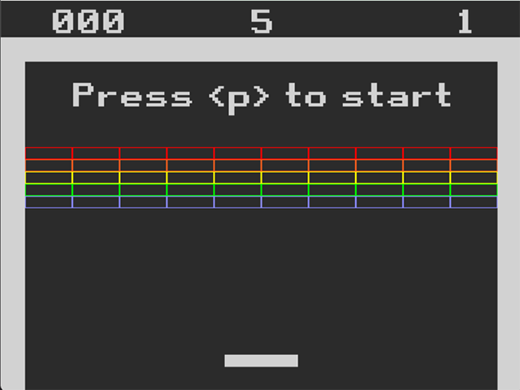
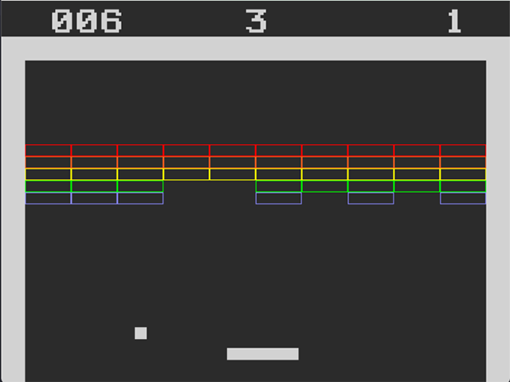

# My SDL Breakout

## Introduction

A classic game of breakout created using C++ and SDL to practice using SDL, C++ and learn more about game programming.

## SDL Extensions

Along with the [SDL library](https://github.com/libsdl-org/SDL), the project also uses some SDL extensions. They are:

-   [SDL_ttf](https://github.com/libsdl-org/SDL_ttf)
-   [SDL_image](https://github.com/libsdl-org/SDL_image)
-   [SDL_mixer](https://github.com/libsdl-org/SDL_mixer)

## Game Assets

The bricks, walls and paddle were made using the SDL's built-in function to render shapes. The text and sound effects were gathered from various external sources.

-   [Retro Gaming Font](https://www.dafont.com/retro-gaming.font)
-   [Sound Effects](https://drive.google.com/file/d/1p6LoHh3pgZJBtgKa2CKesLzPwXlZkPZ5/view) : Changed pitch to get different sound.

## Installation

You can download the zip file for this game from the [release page](https://github.com/nimeshakya/my_sdl_breakout/releases) of this project's repository. There, you can get the `.zip` file for the game itself and also the source code.

You can also clone this repo for the source code.

## Output

Any feedback and queries regarding this project are welcomed! Thank you! :)
